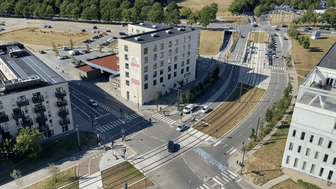
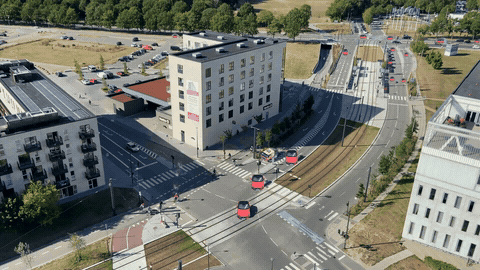

# dronesim

Re-skin drone footage into a storybook cartoon. Objects (cars, trucks, people)
are detected, segmented, and re-painted with a diffusion model while the
background is left untouched. All GPU work runs on [Modal](https://modal.com).

**Stack:** YOLO + ByteTrack (detect/track) → FLUX.1 (cartoon vehicle assets) → SAM2 +
median-plate inpaint (erase the originals) → TIPSv2 zero-shot road mask. 
## Input

Raw drone footage:



## Output

Cartoon re-skin — vehicles are tracked, erased, and replaced with stickers:



## Setup

```bash
uv sync             
modal token new      
```

## Pipeline

Each script is a standalone Modal app. Run from the repo root; each writes its
result to `outputs/<script-name>` (e.g. `src/reskin.py` → `outputs/reskin.mp4`).

| Stage | Script | Input → Output | What it does |
|-------|--------|----------------|--------------|
| Detect + segment | `src/detect_image.py` | image → `outputs/detect_image.png` | DINO boxes + SAM2 masks on one frame |
| Auto-segment | `src/segment_image.py` | image → `outputs/segment_image.png` | SAM2 automatic mask generator (no prompt) |
| Track | `src/track_video.py` | video → `outputs/track_video.mp4` | Seed boxes on frame 0, propagate masks through the clip |
| **Sticker re-skin** | `src/sticker.py` | video → `outputs/sticker.mp4` | **Main:** track vehicles (YOLO + ByteTrack), erase them (SAM2 + median plate), paste FLUX cartoon stickers — on-road only (TIPSv2) |
| Diffusion re-skin | `src/reskin.py` | video → `outputs/reskin.mp4` | Earlier variant: re-style only detected objects via ControlNet, composite over the background |

## Run

```bash
# main deliverable — cartoon re-skin
modal run src/sticker.py --video-path data/clips/aerial_scene2.mp4

# single-frame sanity check
modal run src/detect_image.py --image-path <frame.png>
```

Prompts are overridable, e.g. `--prompt "..."` and `--det-prompt "car . truck ."`.
